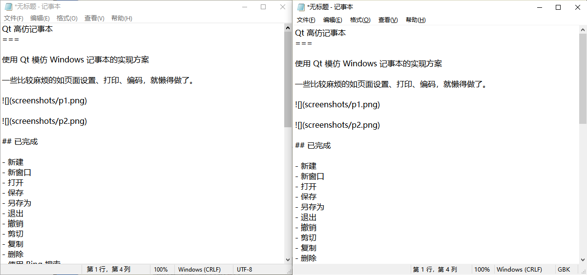

Qt高仿记事本
===

使用 Qt 模仿 Windows 记事本的实现方案

已完成绝大部分功能，查找替换、编码设置有空再做。

一些比较麻烦的如页面设置、打印，就懒得做了。

## 已完成

- 新建
- 新窗口
- 打开
- 保存
- 另存为
- 退出
- 撤销
- 剪切
- 复制
- 删除
- 使用 Bing 搜索
- 全选
- 时间/日期
- 自动换行
- 字体
- 缩放
- 状态栏
- 关于
- 标题
- 光标行列
- 缩放比例